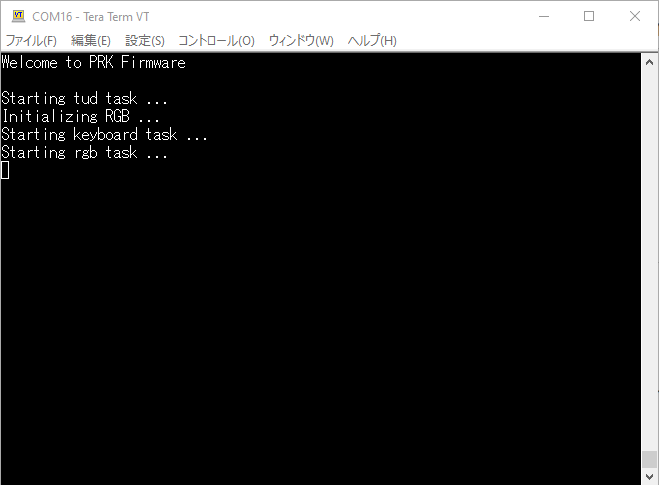
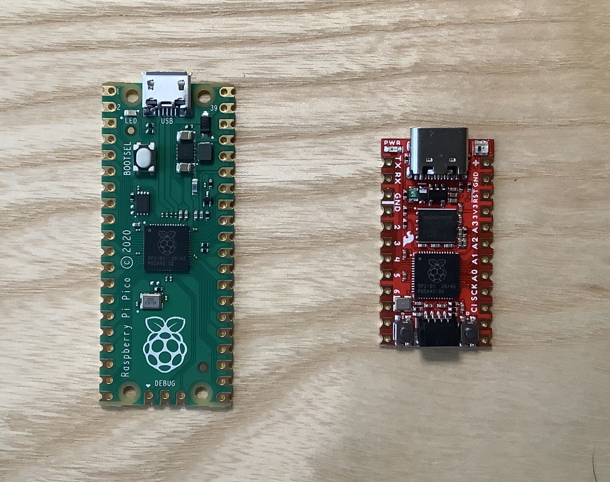

# Change log

## 0.9.21 on 2023/05/23

### [Experimental] Mouse 🐭🖱🖲️ with I2C, SPI, and ADC
- Now you can configure any device such as a trackball, touchpad, and joystick as a Mouse by taking advantage of hardware peripheral features like I2C, SPI, and ADC
- Currently, a Mouse instance on the partner half of a split-type keyboard does not work. We are investigating how to implement
- Because this Mouse feature is experimental, the API design may change during the implementation to make it work on both halves
- Take a good look at [wiki/Mouse](https://github.com/picoruby/prk_firmware/wiki/Mouse)

### The mass storage drive is re-implemented with File class of PicoRuby
- The name of the drive is changed from `PRKFirmware` to `PRK DRIVE`
- `keymap.rb` is no longer deleted on re-installing PRK's uf2
- This re-implementation basically should not affect any other keyboard behaviors

#### Known issue
- Although the drive's functionality is sanity, the host computer sometimes recognizes the drive name as `USB Drive` instead of `PRK DRIVE`. Send us a patch if you could fix it!

## 0.9.20 on 2022/12/04

### Bug fix 💡
- The instability when start-up especially upgrading uf2 is fixed

### Deprecation
- Hardware one-way UART on split-type is deprecated. Instead, software mutual UART is now the default and the only option
  - `Keyboard#mutual_uart_at_my_own_risk=` no longer takes any effect

## 0.9.19 on 2022/12/26

### Bug fix🐛
- An issue that PRK isn't recognized by macOS and iOS from version 0.9.15

### Improvement 🔈
- Sounder pitch might become correct than before but the author experiences somehow unstable behavior until now. Please ping us your opinion from an actual usage

### What's Changed
* Update package database on Docker by @buty4649 in https://github.com/picoruby/prk_firmware/pull/145
* Fix build process by @hasumikin in https://github.com/picoruby/prk_firmware/pull/151
* Get rid of cdc_task() by @hasumikin in https://github.com/picoruby/prk_firmware/pull/146
* Take out Joystick report by @yswallow in https://github.com/picoruby/prk_firmware/pull/152
* Fix Sounder pitch issue by @yswallow in https://github.com/picoruby/prk_firmware/pull/153
* Fix: invalid key input when modifier press by @hasumikin in https://github.com/picoruby/prk_firmware/pull/154

## 0.9.18 on 2022/09/17

### RGB Matrix🌈
See [wiki/RGB Matrix](https://github.com/picoruby/prk_firmware/wiki/RGB-Matrix).

### Sounder🎸 & Music Macro Language🎼
See [wiki/Sounder](https://github.com/picoruby/prk_firmware/wiki/Sounder) and [wiki/Music Macro Languagel](https://github.com/picoruby/prk_firmware/wiki/Music-Macro-Language)

### Keyboard#inject_switch
You can arbitrarily inject a switch position of the matrix as if it was tapped.

See [wiki/Keyboard#inject_switch](https://github.com/picoruby/prk_firmware/wiki/Keyboard-inject_switch).

### [Experimental] BIOS mode🛠️

See [wiki/BIOS mode](https://github.com/picoruby/prk_firmware/wiki/BIOS-mode).

## 0.9.17 on 2022/08/06

### Consumer key 🔈🔇🔊
See [wiki/Consumer key](https://github.com/picoruby/prk_firmware/wiki/Consumer-key)

### Keyboard#send_key🎛️
It now accepts multiple keycodes.
Good for combining with rotary encoders. Check an example on [wiki/Rotary encoder](https://github.com/picoruby/prk_firmware/wiki/Rotary-encoder).

### PRK_DESCRIPTION📝
Version number, built date, and revision hash are shown on serial console at boot time.


### PicoRuby version 3.1🔥

The programming processing system, PicoRuby, upgraded from 3.0 to 3.1.
This shouldn't affect any external behavior regarding keyboard (hopefully🤞).

One beneficial thing to users is that the functionality of exceptions improved.
Let's say you mistakenly write `kbd = Keyb_oard.new`, not `kbd = Keyboard.new`, an error message will show on the serial console:


In such a situation, your keyboard doesn't work as a keyboard but the PRKFirmware storage drive keeps alive. Until version 0.9.16, the drive was unexpectedly unmounted and you might have difficulty rewriting your keymap.rb.

Again, we strongly recommend using a serial console when your keymap.rb doesn't work. See [wiki/Debug print](https://github.com/picoruby/prk_firmware/wiki/Debug-print)

### Bug fix🐛
- An issue related to "Startup time reduced⌨💨" [issues/120](https://github.com/picoruby/prk_firmware/pull/120)
- An issue of RGB [issue/122](https://github.com/picoruby/prk_firmware/issues/122)
- Improve serial console print that used to be often tangled

## 0.9.16 on 2022/07/20

### Improvement
- [Experimental] Startup time reduced⌨💨  
  We really hope all guys try this version and report to us if there's a problem of any kind🙏

## 0.9.15 on 2022/07/19

### Joystick🕹
- See [wiki/Joystick](https://github.com/picoruby/prk_firmware/wiki/Joystick)

### Improvements
- Changeable default layer name. See [wiki/Layers-and-mode-key#Changing-default-layer](https://github.com/picoruby/prk_firmware/wiki/Layers-and-mode-key#changing-default-layer)
- Suppress RGB random flicker on startup

### Bug fix
- A bug that some alias keycodes didn't work [issue/106](https://github.com/picoruby/prk_firmware/issues/106)
- Some fixes of VIA

## 0.9.14 on 2022/05/21

### VIA! VIA!! VIA!!! 🙌
- See [wiki/VIA and Remap](https://github.com/picoruby/prk_firmware/wiki/VIA-and-Remap)

### Caps Lock indicator 🔒💡
- See [wiki/Num Lock, Caps Lock and Scroll Lock](https://github.com/picoruby/prk_firmware/wiki/Num-Lock%2C-Caps-Lock-and-Scroll-Lock)

## 0.9.13 on 2022/04/16

### Software rebooting into BOOTSEL mode 😍
- Now you can reboot RP2040 into BOOTSEL mode by pressing a key where you planted! See [wiki/BOOTSEL mode of RP2040](https://github.com/picoruby/prk_firmware/wiki/BOOTSEL-mode-of-RP2040#software-rebooting)

### Debounce 🤹
- Introduces debounce feature. See [wiki/Debounce](https://github.com/picoruby/prk_firmware/wiki/Debounce) for details

### 4KB limitation lifted 🤸
- The limitation of the maximum size of keymap.rb is lifted. Now it's 10KB (used to be 4KB)

### Bug fix (again) 🤞
- Fixed the issue on 0.9.12 again
- Fixed [issues/52](#52): Aliased keys like KC_SPC don't work in Keyboard#define_composite_key
- Fixed [issues/66](#66): `init_direct_pins` was broken in 0.9.11

## ~~0.9.12 on 2022/01/27~~ revoked
### ~~Bug fix 🐛~~
- ~~Fixed some bugs that relate to mode key.~~
  See [issue/49](https://github.com/picoruby/prk_firmware/issues/49) for details

## 0.9.11 on 2022/01/21
### Duplex matrix 😎
- Now we encourage you to make a duplex matrix keyboard with Seeed XIAO RP2040  
  Check details of the API here: [https://github.com/picoruby/prk_firmware/wiki/Keyscan-matrix#duplex-and-round-robin-matrix](https://github.com/picoruby/prk_firmware/wiki/Keyscan-matrix#duplex-and-round-robin-matrix)

## 0.9.10 on 2022/01/06
### Keyboard#define_composite_key

Now you can define a composite key that reports multiple keycodes at once.

Let's say there is a five-keys pad. You can make the most useful programming tool like this:

```ruby
kbd.add_layer :default, %i(KC_SPACE CUT COPY PASTE KC_ENTER)
kbd.define_composite_key :CUT,   %i(KC_LCTL KC_X)
kbd.define_composite_key :COPY,  %i(KC_LCTL KC_C)
kbd.define_composite_key :PASTE, %i(KC_LCTL KC_V)
```

You can also write the equivalent keymap in this way:

```ruby
kbd.add_layer :default, [ :KC_SPACE, [:KC_LCTL, :KC_X], [:KC_LCTL, :KC_C], [:KC_LCTL, :KC_V], :KC_ENTER ]
```

If you prefer to make an array of symbols with `%i` syntax, the former should seem elegant.

If you don't mind typing more colons, commas, and nested brackets, the latter would be intuitive.

## 0.9.9 on 2021/12/15
### Supports direct scan👏

- Some keyboards support **direct scan**. e.g. https://www.sho-k.co.uk/tech/1246.html  
  Now you can configure it as follow:

  ```ruby
  kbd.set_scan_mode = :direct
  kbd.init_pins(
    [],
    [ 8, 27, 28, 29, 9, 26 ]
  )
  ```
  or

  ```ruby
  kbd.init_direct_pins(
    [ 8, 27, 28, 29, 9, 26 ]
  )
  ```

## 0.9.8 on 2021/12/10
### RotaryEncoder enhancement
- Multiple encoders can be configured on a unit🎛
- `:RGB_xxx` keycodes work with encoders🌈
- The accuracy of rotation made a big improvement😎
### Bug fix
- Some tiny bugs are fixed

## 0.9.7 on 2021/12/02
### Bug fix
- `keymap.rb` with CRLF line terminators now works

## 0.9.6 on 2021/11/30
### Big improvements
- RGB feature
  - Keycodes like `:RGB_TOG` (to toggle the LED between *on* and *off*, for example) are added
    - See more details on [wiki/RGB-feature](https://github.com/picoruby/prk_firmware/wiki/RGB-feature)
  - You can set default values of an RGB instance in keymap.rb. eg) `rgb = RGB.new; rgb.speed` to change the speed of blinking
    - See also [wiki/RGB-feature#in-your-keymaprb](https://github.com/picoruby/prk_firmware/wiki/RGB-feature#in-your-keymaprb)
  - On a split type keyboard like CRKBD, LEDs of left and right will be synchronized when you enable "Mutual UART" (see below)
- Mutual UART communication on a split type keyboard on *TRS* (not TRRS) cable
  - This *experimental* feature realizes
    - Synchronized RGB blinking on both halves (anchor half and partner half)
    - Keycodes like `:RGB_TOG` work also on the "partner half"
  - See [wiki/Mutual-UART-communication](https://github.com/picoruby/prk_firmware/wiki/Mutual-UART-communication)

## 0.9.5 on 2021/10/27
### Breaking Change 🌈
- Amend names of RGB.effect
  - from `:rainbow` to `:swirl`
  - from `:breathing` to `rainbow_mood`
### Improvements
- Some keycodes for Japanese keyboard added. See [pull/31](https://github.com/picoruby/prk_firmware/pull/31)
- Improved startup stability. The startup time is increased, but be patient!

## 0.9.4 on 2021/09/24
### Improvement
- Now you can use "Right side flipped split" keyboard (eg. [Zinc](https://www.sho-k.co.uk/tech/735.html)). See [pull/22](https://github.com/picoruby/prk_firmware/pull/22)

## 0.9.3 on 2021/09/17
### Improvement
- Abbreviated keynames things like `KC_ENT` for `KC_ENTER` can be used in `keymap.rb`. See [bc23e52](https://github.com/picoruby/prk_firmware/commit/bc23e52f51c2899ce5309643f0ab89606a9b469d)

## 0.9.2 on 2021/09/15
### Useful feature 🎉
- You can see debug print on a USB serial port that will be helpful if your `keymap.rb` doesn't work well
  - Configuration:
      
      ```
      Baud: 115200
      Data bits: 8
      Parity: None
      Stop bits: 1
      Flow control: None
      ```

  

## 0.9.1 on 2021/09/12
### Small improvement
- Sparkfun Pro Micro RP2040 will reboot to BOOTSEL mode if you double-press RESET button without detaching USB cable!

  

## 0.9.0 on 2021/09/10 (First release🎊)
### BIG BIG IMPROVEMENT 🍣
- You no longer need any compiler toolchain!!!
- No longer detaching USB cable every time amending your keymap, too!!!
- See README.md 👀

## 2021/08/17
### Breaking Change 💣
- Code upgraded to correspond to the newest pico-sdk as of today. Please upgrade your pico-sdk

## 2021/08/16
### Changed
- Bump up PicoRuby to "mruby3 version"
- There is no external change though, if your keymap doesn't work, try to add `sleep 1` to the beggining of your keymap.rb

## 2021/06/19
###  New feature added
- Rotary Encoders &#x1F39B;
  - Find an example in [prk_helix_rev3/keymap.rb](https://github.com/picoruby/prk_helix_rev3/blob/master/keymap.rb)

## 2021/06/01
### Breaking Change 💣
- The second argument of `Keyboard#add_layer`

  Before the change: `Array[Array[Symbol]]`
  ```ruby
  kbd.add_layer :default, [
    %i(KC_ESCAPE KC_Q KC_W KC_E KC_R KC_T KC_Y KC_U KC_I KC_O KC_P      KC_MINUS),
    %i(KC_TAB    KC_A KC_S KC_D KC_F KC_G KC_H KC_J KC_K KC_L KC_SCOLON KC_BSPACE),
    ...
  ]
  ```

  After the change: `Array[Symbol]`
  ```ruby
  kbd.add_layer :default, %i(
    KC_ESCAPE KC_Q KC_W KC_E KC_R KC_T KC_Y KC_U KC_I KC_O KC_P      KC_MINUS
    KC_TAB    KC_A KC_S KC_D KC_F KC_G KC_H KC_J KC_K KC_L KC_SCOLON KC_BSPACE
    ...
  )
  ```

## 2021/05/21
### Dependency
- CRuby (MRI) for static type checking by RBS and Steep
### Changed
- Directory of Ruby source is changed from `src/` to `src/ruby/`

## 2021/05/08
###  Added
- RGB class 🌈

## 2021/04/14
- Published as a public beta 🎉
