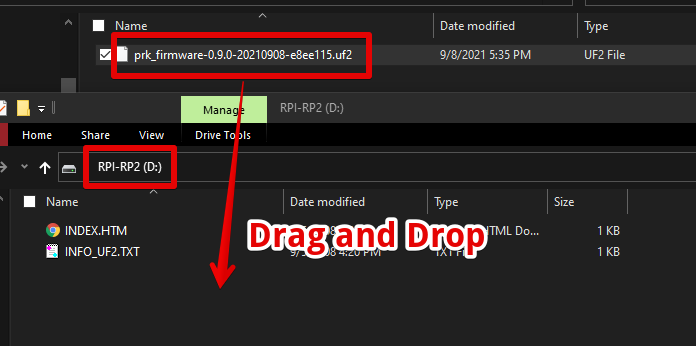
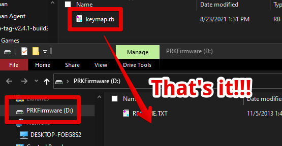

[](https://github.com/picoruby/prk_firmware/actions/workflows/ruby.yml)

## PRK Firmware (public beta)

PRK Firmware is a framework for DIY-keyboards written and configured in [PicoRuby](https://github.com/picoruby/picoruby) which is an alternative mruby implementation targeting on one-chip microcontroller.

### Features

- A "keymap" can be configured in Ruby which is a concise, readable and happy language
- RP2040 is the target platform microcontroller
- You can write your own "action" which will be invoked when you tap or hold a key ([example]()(TBD))

### Boards

The following boards have been confirmed to work as of now:

- Raspberry Pi Pico
- Sparkfun Pro Micro RP2040 (~~DEV-17177~~ now it's DEV-18288)


_(left: Raspberry Pi Pico / right: Sparkfun Pro Micro RP2040)_

### Roadmap

- [x] Unsplit keyboard
- [ ] Split keyboard
  - [x] Symmetrical type. eg) Crkbd
  - [ ] Asymmetrical type. eg) ???
  - [x] UART communication between left and right
  - [ ] I2C communication between left and right
- [x] Macros
- [ ] Media keys
- [x] RGBLED. An example on [picoruby/prk_crkbd](https://github.com/picoruby/prk_crkbd/blob/main/keymap.rb)
- [ ] OLED display
- [x] Rotary encoder. An example on [prk_helix_rev3/keymap.rb](https://github.com/picoruby/prk_helix_rev3/blob/master/keymap.rb)
- [ ] Mouse / Trackball
- [x] Debugging over a serial port

### Getting started

There are two ways to install PRK Firmware:

1. [Using a release binary (recommended)](#Using-a-release-binary)
2. [Building a binary by yourself](#Building-a-binary-by-yourself)

Anyhow, you should:

- Be knowledgeable how to install a UF2 file into Raspi Pico on [https://www.raspberrypi.org/documentation/rp2040/getting-started/#getting-started-with-c](https://www.raspberrypi.org/documentation/rp2040/getting-started/#getting-started-with-c)
  - [https://learn.sparkfun.com/tutorials/pro-micro-rp2040-hookup-guide](https://learn.sparkfun.com/tutorials/pro-micro-rp2040-hookup-guide) will also be helpful if you use Sparkfun Pro Micro RP2040

#### Using a release binary

- Download the newest release binary from [Releases](https://github.com/picoruby/prk_firmware/releases)

- Unzip it. You should get a file that looks like `prk_firmware-0.9.0-20210910-xxxxxxxx.uf2`

- Flash the uf2 into RP2040

  

- `PRKFirmware` mass storage drive should be mounted, then drag and drop your `keymap.rb`

  

Your keyboard will automatically reboot. Enjoy!

#### Building a binary by yourself

(See also [Contributing](#Contributing))

You may not want PRK Firmware to be a mass storage device in case that your employer doesn't allow you to bring a USB memory 🙈

- Install CRuby (MRI) because "Static type checking" by [Steep](https://github.com/soutaro/steep) will be invoked in build process

- Setup Raspberry Pi Pico C/C++ SDK

  - Follow the instructions on [https://github.com/raspberrypi/pico-sdk#quick-start-your-own-project](https://github.com/raspberrypi/pico-sdk#quick-start-your-own-project)
    - Make sure you have `PICO_SDK_PATH` environment variable


- Clone the `prk_firmware` (this repository) wherever you like

    ```
    git clone --recursive https://github.com/picoruby/prk_firmware.git # Don't forget --recursive
    cd prk_firmware
    ```

- Clone a keymap repository, for example, "meishi2" which is a 2x2 matrix card-shaped keyboard in `keyboards` directory

    ```
    cd keyboards
    git clone https://github.com/picoruby/prk_meishi2.git
    ```

- (Option) Edit `prk_meishi2/keymap.rb` as you wish

- Build with `cmake` and `make`

    ```
    cd [path]/[to]/prk_meishi2/build
    cmake -DPRK_NO_MSC=1 ../../..
    make
    ```

    (Defining PRK_NO_MSC macro will avoid implementing mass storage feature)

    Now you should have `prk_firmware-[version]-[date]-no_msc.uf2` file in `prk_firmware/keyboards/prk_meishi2/build/` directory which includes your keymap in code.

- (Troubleshooting) If you got an error on `cmake -DPRK_NO_MSC=1 ../../..`
  - Try [this procedure](#building-uf2-of-excluding-keymap-version) once
  - Then, redo `cmake` again

- Install that `.uf2` file into RP2040

### Build with Docker

- On macOS, you can use docker to build it

```
docker build -o keyboards --build-arg KEYBOARD=prk_meishi2 .
```

### What if split type keyboard?

- Make sure installing your setup on both side

### Tips

- You can see debug print on a "USB Serial Port" (so-called "COM Port" in Windows) that will be helpful if your `keymap.rb` doesn't work well

    ```
    Baud: 115200
    Data bits: 8
    Parity: None
    Stop bits: 1
    Flow control: None
    ```

  

### Contributing

#### Building uf2 of excluding-keymap-version

```
# in the top directory of prk_firmware
./setup.sh
cd build
make
```

Then patch and send a pull request.

#### Docker

You can use [Dockerfile](https://github.com/picoruby/prk_firmware/blob/master/Dockerfile) to build if you prefer.

#### For those who are willing to contribute to PRK or write your own keymaps:

- It's possible that your Ruby code can't be compiled as you wish
  - Remember that "Ruby" in PRK is neither CRuby nor even mruby
  - [PicoRuby](https://github.com/picoruby/picoruby) doesn't support some Ruby syntax and may have bugs. It would be great if you send a patch, too!
- Unlike QMK Firmware, prk_firmware repository doesn't include individual keymaps

### Keymaps for example

- Raspberrypi Pi Pico
  - [PiPi Gherkin](https://github.com/picoruby/prk_pipigherkin)

- Sparkfun Pro Micro RP2040 (DEV-17717)
  - [meishi2](https://github.com/picoruby/prk_meishi2)
  - [Crkbd](https://github.com/picoruby/prk_crkbd)
  - [Claw44](https://github.com/picoruby/prk_claw44)
  - [Helix rev3](https://github.com/picoruby/prk_helix_rev3)

#### To keyboard creators:

Feel free to reach out to [me](https://twitter.com/hasumikin) if you want me to link your keymap on this README.

### FAQ

- Q: Can I use Sparkfun Pro Micro RP2040 as a drop-in replacement instead of a Pro Micro without having to modify the CRKBD PCB?

  A: Yes you can! However, note that exising LEDs on your CRKBD may not blink ~~RGBLED feature is still not implemented on PRK. And don't expect your existing CRKBS's LEDs will blink even if the feature is ready~~ because the logic voltage of RP2040 is 3.3V while 5V on "normal Pro Micro". It depends on the specificaion of LED.

  In terms of 3.3V, you should be careful of the same thing which is warned on Proton-C: https://qmk.fm/proton-c/

  > Some of the PCBs compatible with Pro Micro have VCC (3.3V) and RAW (5V) pins connected (shorted) on the pcb. Using the Proton C will short 5V power from USB and regulated 3.3V which is connected directly to the MCU. Shorting those pins may damage the MCU on the Proton C.
  >
  > So far, it appears that this is only an issue on the Gherkin PCBs, but other PCBs may be affected in this way.
  >
  > In this case, you may want to not hook up the RAW pin at all.

- Q: PRK Firmware no longer works after pulling the newest master branch, why?

  A: It likely happens when submodules like PicoRuby were also updated, try `git submodule update --recursive`. Besides, PRK may get a breaking change as it is still a beta version. Take a good look at [CHANGELOG.md](CHANGELOG.md)


### License

Copyright © 2021 HASUMI Hitoshi. See MIT-LICENSE for further details.
